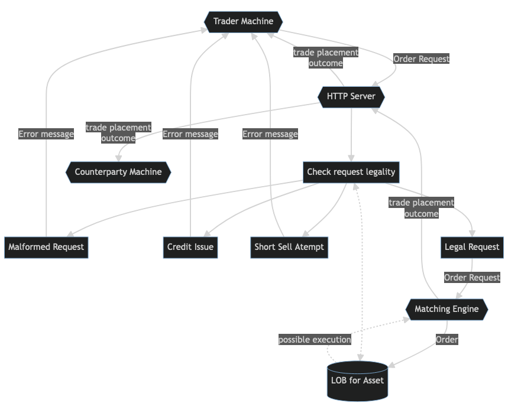

# Rust Matching Engine, Limit Order Book, and Exchange Simulator
Simplistic exchange simulator with in memory order book and multi asset credit limit enforcement.

[Flowchart Link](https://mermaid.live/edit#pako:eNqVU9tOg0AQ_ZXJPmli_QBiTJRSNWmjsbyBDytMgZRlcXYwNsC_uwtWaaNG92ku58yZnZ1tRaJTFJ7ISNY5hPO4AnuYZIq0kkleVNi24eDCh9_3MJtddvfkYo_40qDhDm7D8GGN9IrUts6G0en7seJX2pHBj_wcky3QSIcSM1kWvHsa0b4DBdFKlhtNCtO9zDS9iHzCtGC4M6bBaeYmWuea2HZQlnDFqOoDYqZ1OtwoWjrVo9qLob8uINIECo2RGXaHAxmBN38FBn8FfjY2Eo4GrCQ7bBZU2fAoqw8fxsB-0IewSaUOlvfXI8YaMDt3mVobUzyXCPiGScOFro6F9oO7GAiWGZ04un0XuDIG-fTpZ93hjlCXMkGFFccWqRtOtMLpvny7IL9yv5ndf-iJbipGqiXx7nPH_UlwsuniTCgkJYvUfpLWacWCc1szFp41U0nbWMRVb3GyYb3eVYnwmBo8E02dSsZ5Ie3fUsLbyNJg_w7wdizz)

## Limit Order Book (LOB)
Main memory structure, consisting of two half books (buy and sell), storing the current status of outstanding orders. 

## Matching Engine
Handles incoming buy/sell/cancel order requests by "efficiently" updating the LOB

## Exchange API
One connection/thread per trader, handles listening, reporting, and interfacing with matching engine. 
Handled via tokio and hyper
On request:
* Checks non malformed trade
* Checks legality of trade (i.e. respects credit limits, rate limiting, etc.)
* Makes a call to handle incoming request of the appropriate orderbook struct. 
* This is blocking, and other connection handlers must wait for orderbook to be unlocked in order to pass a request
* Could implement some kind of queue here to allow temporary burst traffic, but I think the simple version should be enough

## Complile Time Asset List/User IDs
* The list of assets is injected via macros and a build script. This is to allow for a single list across multiple files, types, and contexts (primarily) to allow for the construction of structs which store application state. 
* This should allow for more configuration in the future (i.e. min and max prices, credit limits per asset etc.) to be extracted to another file. 

## Enforcing Credit Limits
Going short is not allowed (i.e. in order to place sell order, you must actually have adequate supply of the asset).

Instead of allowing for shorts, we can introduce "inversed" assets of each type to allow for negative exposure, also maybe nice opportunity for people to try an arbitrage strategy. 

Going into debt is not allowed (i.e. in order to place a buy order, the total value of all your buy orders across assets must be leq to your current money supply)

## Account Management
Each account has a central money balance as well as balances for each asset
The rate limiting is done per account rather than per asset (?)

## Resources/Further Reading
(Generally tried to sort from most to least useful)

https://web.archive.org/web/20110219163448/http://howtohft.wordpress.com/2011/02/15/how-to-build-a-fast-limit-order-book/

https://web.archive.org/web/20110219163418/http://howtohft.wordpress.com/2011/02/15/building-a-trading-system-general-considerations/

https://www.youtube.com/watch?v=b1e4t2k2KJY

https://www.sciencedirect.com/science/article/pii/S2352711022000875

https://sanket.tech/posts/rustbook/

https://docs.rs/orderbook/latest/orderbook/

https://devexperts.com/blog/what-it-takes-to-build-reliable-and-fast-exchange/

https://github.com/charles-cooper/itch-order-book

https://www.chrisstucchio.com/blog/2012/hft_apology.html

https://marabos.nl/atomics/basics.html

https://markrbest.github.io/hft-and-rust/

https://rustrepo.com/repo/uinb-galois

https://github.com/yangfh2004/rust-limit-order-book

https://dev.to/deciduously/oops-i-did-it-againi-made-a-rust-web-api-and-it-was-not-that-difficult-3kk8

https://hyper.rs/guides/1/server/hello-world/

https://docs.rs/tokio/latest/tokio/

## CAP CGMD idea dump
Price of each asset is tied to a real world value with sufficient movement and noise to be interesting, e.g. the temperature as measured in Alma's lap. This price would then be enforced by guaranteeing some amount of trading at a lagged price (i.e. actually have a temperature sensor) from a dummy account. 

Other asset ideas (told e.g. 1 month before event):
* wind speed somewhere on campus
* number of internet connections in butler
* a random number generator each second
* average price of all other assets and the end of competition (no price enforcement)
* behavior of some insects moving across a scale

Also makes modelling a bit more interesting/open-ended, as people can be creative leading up to event, and maybe try to manipulate market.

## Misc. Ideas
* Sqlite/Reddis?
* Better data structure for orderbook?
* More robust account management?

## Todo:
* convert global state to actor which has a list of all trader account addresses to send messages to etc.
* convert trader accounts to actix actors which register new streams as connections are made or dropped